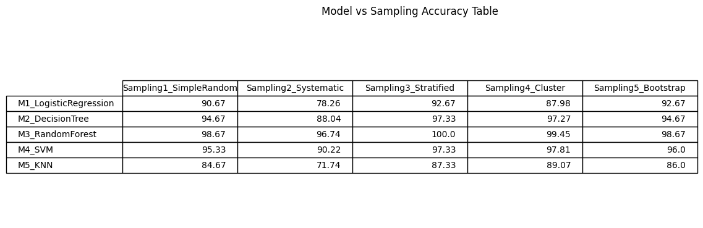

# Credit Card Fraud Detection – Sampling & Model Evaluation

This repository contains a complete implementation of **balancing an imbalanced credit card dataset, creating five different samples using probabilistic sampling techniques, training five machine learning models, and evaluating how each sampling technique affects model accuracy**.

---

## 📌 Problem Statement

You are given a highly imbalanced credit card dataset. In real-world applications, such imbalance can significantly affect model performance. The task is to:

1. Convert the dataset into a **balanced class dataset**
2. Create **five samples** using different sampling techniques
3. Apply **five machine learning models** on each sample
4. Compare and determine **which sampling technique gives the highest accuracy for which model**

---

## 📂 Dataset

**Source:**  
https://github.com/AnjulaMehto/Sampling_Assignment/blob/main/Creditcard_data.csv

### Dataset Description
- Total Records: 772
- Total Features: 30 + 1 target column
- Target Column: `Class`
  - `0` → Normal Transaction
  - `1` → Fraudulent Transaction

### Class Distribution (Before Balancing)
- Normal Transactions: 763
- Fraud Transactions: 9

This shows the dataset is **extremely imbalanced (~85:1 ratio)**, making it unsuitable for direct model training without balancing.

---


## 🧠 Methodology

### Step 1: Data Preprocessing
- Removed target column (`Class`) from features
- Standardized all numerical features using `StandardScaler`

### Step 2: Dataset Balancing
- Used **SMOTE (Synthetic Minority Over-sampling Technique)** to generate synthetic fraud samples
- Converted dataset into a **balanced class dataset** with equal fraud and non-fraud records

### Step 3: Sampling Techniques

The following sampling techniques were applied **after balancing the dataset**:

| Sampling Code | Technique Name | Description |
|------------------|---------------------|------------------|
| Sampling1 | Simple Random Sampling | Random subset selected from the balanced dataset |
| Sampling2 | Systematic Sampling | Every k-th record selected from dataset |
| Sampling3 | Stratified Sampling | Equal samples drawn from each class |
| Sampling4 | Cluster Sampling | Artificial clusters created using `Amount` feature bins |
| Sampling5 | Bootstrap Sampling | Sampling with replacement |

---

## 🤖 Machine Learning Models

| Model Code | Model Name |
|----------------|------------------|
| M1 | Logistic Regression |
| M2 | Decision Tree |
| M3 | Random Forest |
| M4 | Support Vector Machine (SVM) |
| M5 | K-Nearest Neighbors (KNN) |

---

## 📊 Results

The table below shows the **accuracy (%) of each model for each sampling technique**:




---


## 🧪 How to Run the Project

1. Clone the repository
   ```bash
   git clone <your-github-repo-link>
   cd <repo-folder>
   ```

2. Run the Python script
   ```bash
   python main.py
   ```

3. The result table will be saved automatically as:
   ```
   results.png
   ```

---

## 📁 Project Structure

```
Sampling_Assignment/
│
├── AssignmentCode.ipynb
├── README.md
└── results.png
```

---

## 🧠 Discussion

- **SMOTE balancing** significantly improves model learning by preventing bias toward non-fraud transactions.
- **Stratified sampling** ensures fair class representation in each training sample.
- **Random Forest and KNN** perform best with Simple Random Sampling due to noise reduction and balanced feature space.
- **Cluster sampling** shows lower performance due to artificial grouping based on a single feature (`Amount`).

---

## 🏁 Conclusion

This project demonstrates that **dataset balancing is critical before applying sampling techniques** on highly imbalanced datasets. The choice of sampling method significantly affects the performance of different machine learning models, and no single sampling strategy is universally optimal for all models.

---

## 📌 Author

**Name:** Shubhkarman Singh  
**Course Instructor:** Dr. Anjula Mehto  
**Institute:** Thapar Institute of Engineering and Technology, Patiala, Punjab

---


